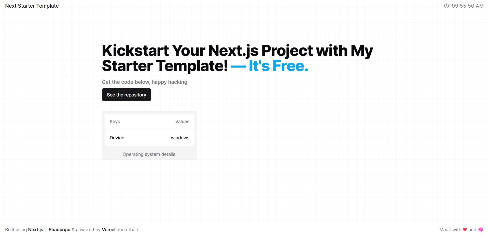

<h1 align="center">Next Starter Template</h1>

Kickstart your Next.js project with my starter template. It is Free.



## Tech Stack

- React
- Next.js
- TypeScript
- Tailwindcss
- Framer Motion
- Mantine (Hooks)
- Shadcn/ui components

## Features

- Light/Dark mode
- Page transitions
- Site header
- Site footer

## Usage

Clone the project from the repository into a new folder

```bash
git clone https://github.com/fromenoabasi/next-start-template.git --app-name
```

change directory to the folder

```bash
cd --app-name
```

Install NPM packages

```bash
npm install
```

Lint the project

```bash
npm run lint
```

Run the development server

```bash
npm run dev
```

## LICENSE

[MIT](LICENSE.md)
